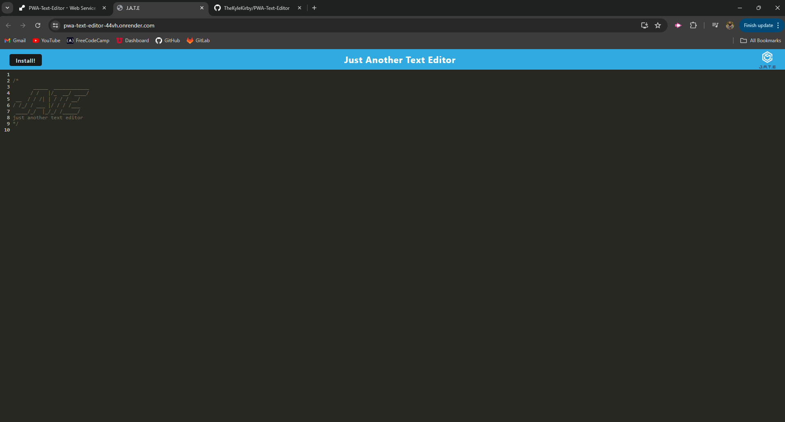

# PWA Text Editor
## Description

Here is a text editor that can be ran in your web browser! It can also function offline.
- I wanted to build something that I could take notes with online or off.
- This project really helped me learn and understand how progressive web applications work.

## Usage

Here is the deployed link: https://pwa-text-editor-44vh.onrender.com 

Here is a screenshot of the deployed application using Render.

## Credits

If you would like to contact me or find more of my work, please checkout my GitHub! https://github.com/TheKyleKirby 
